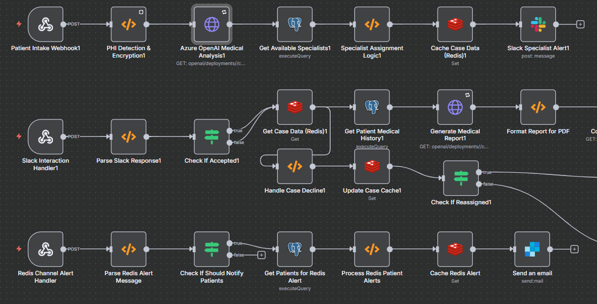

<div align="center">
  
  
  # 🏥 Healthcare Patient Care Coordination Pipeline
  
  [](https://n8n.io/)
  [](https://www.docker.com/)
  [](https://www.postgresql.org/)
  [](https://redis.io/)
  [](https://azure.microsoft.com/en-us/services/openai/)
  [](https://www.hhs.gov/hipaa/index.html)
  [](LICENSE)
  
  **Automated patient intake, specialist assignment, and care coordination using n8n workflows**
  
  [Features](#-features) • [Quick Start](#-quick-start) • [Architecture](#-architecture) • [API Reference](#-api-reference) • [Contributing](#-contributing)
</div>

---

## 🎯 Overview

This project implements a **HIPAA-compliant healthcare automation system** that streamlines patient care coordination through intelligent workflows. Built with n8n, it automates the entire patient journey from initial intake to specialist assignment, medical report generation, and appointment scheduling.

### ✨ Key Capabilities

- **🤖 AI-Powered Triage**: Azure OpenAI analyzes patient symptoms and assigns appropriate specialists
- **🔐 PHI Encryption**: Automatic detection and encryption of Protected Health Information
- **👨‍⚕️ Smart Specialist Assignment**: Intelligent routing based on availability and expertise
- **📱 Multi-Channel Notifications**: Slack, email, and SMS alerts for care teams
- **📄 Automated Reports**: LLM-generated medical reports converted to PDF
- **📅 Appointment Scheduling**: Calendly integration for seamless booking
- **🚨 Real-time Monitoring**: Redis-based alert system for critical communications

## 🏗️ Architecture

```
┌─────────────────┐    ┌─────────────────┐    ┌─────────────────┐
│   Patient Form  │───▶│   n8n Workflow  │───▶│  Azure OpenAI   │
│   (Webhook)     │    │   Engine        │    │   Analysis      │
└─────────────────┘    └─────────────────┘    └─────────────────┘
                                │
                                ▼
┌─────────────────┐    ┌─────────────────┐    ┌─────────────────┐
│   PostgreSQL    │◀───│   Specialist    │───▶│   Slack Bot     │
│   Database      │    │   Assignment    │    │   Notifications │
└─────────────────┘    └─────────────────┘    └─────────────────┘
                                │
                                ▼
┌─────────────────┐    ┌─────────────────┐    ┌─────────────────┐
│   Redis Cache   │◀───│   Medical       │───▶│   SendGrid      │
│   & Alerts      │    │   Report Gen    │    │   Email         │
└─────────────────┘    └─────────────────┘    └─────────────────┘
                                │
                                ▼
┌─────────────────┐    ┌─────────────────┐    ┌─────────────────┐
│   Calendly      │◀───│   PDF           │───▶│   Twilio SMS    │
│   Scheduling    │    │   Generation    │    │   Notifications │
└─────────────────┘    └─────────────────┘    └─────────────────┘
```

## 📁 Project Structure

```
Patient-care-automation-system/
├── 📄 README.md                           # This file
├── 🐳 docker-compose.yml                  # Docker services configuration
├── 🔐 .env                                # Environment variables (create locally)
├── 🗄️ init.sql                           # PostgreSQL initialization script
├── 🗄️ synthetic-patient-database.sql     # Sample patient and specialist data
├── 🔄 healthcare-complete-workflow.json   # Main n8n workflow
├── 🔄 redis-slack-alert-workflow.json    # Redis alert monitoring workflow
├── 📄 pdf-generation-nodes.json          # PDF generation enhancement nodes
├── 📋 SETUP.md                           # Detailed setup instructions
├── 📋 COMPLETE-INTEGRATION-SETUP.md      # Complete integration guide
├── 📋 INTEGRATION-GUIDE.md               # Workflow integration guide
├── 📋 DEPLOYMENT.md                      # Deployment and operations guide
├── 🛠️ fix-azure-credentials.bat          # Azure credentials fix script
├── 🛠️ fix-azure-credentials.ps1          # PowerShell version
├── 🧪 test-healthcare-system.bat         # System testing script
├── 🧪 test-healthcare-system.ps1         # PowerShell testing script
├── 📁 .gitignore                         # Git ignore patterns
└── 📄 LICENSE                            # MIT License
```

## 🚀 Quick Start

### Prerequisites

- [Docker Desktop](https://www.docker.com/products/docker-desktop/) (Windows/Mac/Linux)
- [Git](https://git-scm.com/)
- Azure OpenAI API access
- Slack workspace with admin permissions
- SendGrid API key
- Twilio account and phone number

### 1. Clone and Setup

```bash
git clone https://github.com/yourusername/Patient-care-automation-system.git
cd Patient-care-automation-system
```

### 2. Configure Environment

```bash
# Copy environment template
cp .env.example .env

# Edit with your API keys
nano .env  # or use your preferred editor
```

**Required Environment Variables:**
```bash
# Azure OpenAI
AZURE_OPENAI_API_KEY=your_key_here
AZURE_OPENAI_ENDPOINT=https://your-resource.openai.azure.com/
AZURE_OPENAI_DEPLOYMENT_NAME=your_deployment_name
AZURE_OPENAI_API_VERSION=2024-02-15-preview

# PHI Encryption
PHI_ENCRYPTION_KEY=your_32_char_hex_key

# SendGrid
SENDGRID_API_KEY=your_sendgrid_key
SENDGRID_FROM_EMAIL=noreply@yourdomain.com

# Twilio
TWILIO_ACCOUNT_SID=your_twilio_sid
TWILIO_AUTH_TOKEN=your_twilio_token
TWILIO_FROM_NUMBER=+1234567890

# Slack
SLACK_BOT_TOKEN=your_slack_bot_token
SLACK_SIGNING_SECRET=your_slack_signing_secret
```

### 3. Start Services

```bash
# Start all services
docker compose up -d

# Verify services are running
docker compose ps
```

### 4. Access n8n

- **URL**: http://localhost:5678
- **Create admin account** on first visit
- **Import workflows** from JSON files

### 5. Test System

```bash
# Run test script
./test-healthcare-system.ps1

# Or manually test webhooks
curl -X POST http://localhost:5678/webhook-test/patient-intake \
  -H "Content-Type: application/json" \
  -d '{"firstName": "John", "lastName": "Doe", "age": 55}'
```

## 🔧 Configuration

### Database Setup

```bash
# Load synthetic data
docker cp synthetic-patient-database.sql patient-care-automation-system-postgres-1:/tmp/
docker compose exec postgres psql -U n8n -d n8n_healthcare -f /tmp/synthetic-patient-database.sql
```

### n8n Credentials

Create these credentials in n8n:

| Service | Type | Configuration |
|---------|------|---------------|
| **Healthcare PostgreSQL** | PostgreSQL | Host: `postgres`, DB: `n8n_healthcare`, User: `n8n` |
| **Healthcare Redis** | Redis | Host: `redis`, Port: `6379` |
| **Healthcare Slack Bot** | Slack | OAuth Token from Slack app |
| **Healthcare SendGrid** | Send Email | SMTP: `smtp.sendgrid.net:587` |
| **Healthcare Twilio** | Twilio | Account SID + Auth Token |

### Slack App Configuration

1. **Create Slack app** from `slack-app-manifest.json`
2. **Install to workspace** with required permissions
3. **Configure webhook URLs** in Slack app settings
4. **Add bot to channels**: `#patient-alerts`, `#redis-alerts`

## 📊 API Reference

### Webhook Endpoints

| Endpoint | Method | Description | Payload |
|----------|--------|-------------|---------|
| `/webhook/patient-intake` | POST | Patient registration and triage | Patient data JSON |
| `/webhook/slack-interaction` | POST | Handle Slack button clicks | Slack payload |
| `/webhook/redis-channel-alert` | POST | Process Redis alerts | Alert data JSON |

### Patient Intake Payload

```json
{
  "firstName": "John",
  "lastName": "Doe",
  "age": 55,
  "gender": "Male",
  "phoneNumber": "+15551234567",
  "email": "john.doe@email.com",
  "chiefComplaint": "Chest pain and shortness of breath",
  "symptoms": "Severe chest pain, difficulty breathing, fatigue",
  "medicalHistory": "Hypertension, diabetes type 2"
}
```

### Response Format

```json
{
  "success": true,
  "caseId": "CASE-1234567890",
  "assignedSpecialist": "Dr. Emily Smith",
  "specialty": "Cardiology",
  "estimatedWaitTime": "2-4 hours"
}
```

## 🧪 Testing

### Automated Testing

```bash
# Run comprehensive tests
./test-healthcare-system.ps1

# Test individual webhooks
./test-healthcare-system.bat
```

### Manual Testing

1. **Patient Intake**: Send POST to `/webhook/patient-intake`
2. **Slack Integration**: Click Accept/Decline buttons in Slack
3. **Redis Alerts**: Post message in `#redis-alerts` channel
4. **Email/SMS**: Verify notifications are sent

### Test Data

The system includes **10 synthetic patients** and **10 specialists** for testing:

- **Patients**: Various medical conditions and histories
- **Specialists**: Different specialties with availability tracking
- **Medical Data**: Realistic symptoms, medications, and diagnoses

## 🔐 Security & Compliance

### HIPAA Compliance Features

- **PHI Encryption**: AES-256 encryption for sensitive data
- **Audit Logging**: Complete trail of all data access and changes
- **Access Controls**: Role-based permissions and authentication
- **Data Minimization**: Only necessary PHI is collected and stored
- **Secure Communication**: All API calls use proper authentication

### Security Measures

- **Environment Variables**: Sensitive data stored in `.env` (not in code)
- **Docker Isolation**: Services run in isolated containers
- **Network Security**: Internal communication between containers only
- **SSL/TLS**: Encrypted connections for external APIs
- **Regular Updates**: Keep dependencies and base images updated

## 🚨 Troubleshooting

### Common Issues

| Issue | Solution |
|-------|----------|
| **Azure OpenAI [undefined]** | Run `./fix-azure-credentials.ps1` |
| **Database Connection Failed** | Check `docker compose ps` and restart services |
| **Webhook 404 Errors** | Ensure workflows are imported and activated |
| **Slack Integration Issues** | Verify bot permissions and webhook URLs |
| **PDF Generation Fails** | Check HTML-to-PDF service availability |

### Debug Commands

```bash
# Check service status
docker compose ps

# View service logs
docker compose logs n8n
docker compose logs postgres
docker compose logs redis

# Test database connection
docker compose exec postgres psql -U n8n -d n8n_healthcare -c "SELECT 1;"

# Check Redis
docker compose exec redis redis-cli -a your_password ping
```

## 📈 Monitoring & Operations

### Health Checks

```bash
# Service status
docker compose ps

# Database queries
docker compose exec postgres psql -U n8n -d n8n_healthcare -c "SELECT COUNT(*) FROM patients;"

# Redis monitoring
docker compose exec redis redis-cli -a your_password KEYS "*"
```

### Performance Metrics

- **Response Time**: Webhook processing latency
- **Throughput**: Patients processed per hour
- **Error Rate**: Failed workflow executions
- **Resource Usage**: CPU, memory, and storage

### Log Management

- **n8n Logs**: Workflow execution and errors
- **Database Logs**: Query performance and errors
- **Redis Logs**: Cache operations and memory usage
- **Application Logs**: Custom business logic logging

## 🚀 Deployment

### Production Considerations

1. **Environment**: Use production-grade hosting (AWS, Azure, GCP)
2. **Database**: Managed PostgreSQL service with backups
3. **Redis**: Managed Redis service with persistence
4. **SSL**: Configure proper SSL certificates
5. **Monitoring**: Set up application performance monitoring
6. **Backups**: Regular database and configuration backups

### Scaling

- **Horizontal Scaling**: Multiple n8n instances behind load balancer
- **Database Scaling**: Read replicas for heavy queries
- **Redis Clustering**: Redis cluster for high availability
- **Container Orchestration**: Kubernetes for production deployments

## 🤝 Contributing

### Development Setup

1. **Fork the repository**
2. **Create feature branch**: `git checkout -b feature/amazing-feature`
3. **Make changes** and test thoroughly
4. **Commit changes**: `git commit -m 'Add amazing feature'`
5. **Push to branch**: `git push origin feature/amazing-feature`
6. **Open Pull Request**

### Code Standards

- **Formatting**: Use consistent indentation and naming
- **Documentation**: Update README and code comments
- **Testing**: Include tests for new features
- **Security**: Follow HIPAA compliance guidelines

### Testing Guidelines

- **Unit Tests**: Test individual workflow nodes
- **Integration Tests**: Test complete workflow execution
- **Security Tests**: Verify PHI encryption and access controls
- **Performance Tests**: Ensure acceptable response times

## 📄 License

This project is licensed under the MIT License - see the [LICENSE](LICENSE) file for details.

## 🙏 Acknowledgments

- **n8n Team** for the amazing workflow automation platform
- **Azure OpenAI** for intelligent medical analysis capabilities
- **Slack** for team communication and bot integration
- **Open Source Community** for various tools and libraries used

## 📞 Support

### Getting Help

- **Documentation**: Check the guides in this repository
- **Issues**: Report bugs via GitHub Issues
- **Discussions**: Use GitHub Discussions for questions
- **Community**: Join n8n community forums

### Contact

- **Project Maintainer**: [Your Name](mailto:your.email@example.com)
- **GitHub Issues**: [Create Issue](https://github.com/yourusername/Patient-care-automation-system/issues)
- **Documentation**: [Wiki](https://github.com/yourusername/Patient-care-automation-system/wiki)

---

<div align="center">
  <p>Made with ❤️ for better healthcare automation</p>
  <p>Built with <a href="https://n8n.io">n8n</a> • <a href="https://www.docker.com">Docker</a> • <a href="https://azure.microsoft.com/en-us/services/openai">Azure OpenAI</a></p>
</div>
